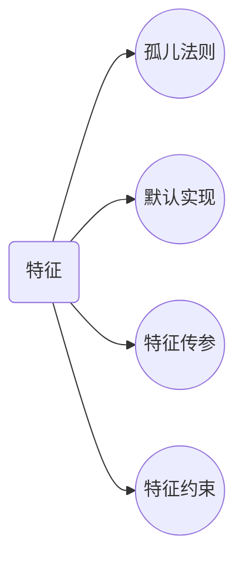

## rust

#### 切片

定义

> 对集合的部分引用

#### 特征

__思维导图__ 



定义

> 把一些方法组合在一起，目的是定义一个实现某些目标所必需的行为的集合。

##### 孤儿规则

关于特征实现与定义的位置，有一条非常重要的原则：如果你想要为类型 A 实现特征 T，那么 A 或者 T 至少有一个是在当前作用域中定义的！ 例如我们可以为上面的 Post 类型实现标准库中的 Display 特征，这是因为 Post 类型定义在当前的作用域中。同时，我们也可以在当前包中为 String 类型实现 Summary 特征，因为 Summary 定义在当前作用域中。

但是你无法在当前作用域中，为 String 类型实现 Display 特征，因为它们俩都定义在标准库中，其定义所在的位置都不在当前作用域，跟你半毛钱关系都没有，看看就行了。

该规则被称为孤儿规则，可以确保其它人编写的代码不会破坏你的代码，也确保了你不会莫名其妙就破坏了风马牛不相及的代码。

##### 默认实现

默认实现
你可以在特征中定义具有默认实现的方法，这样其它类型无需再实现该方法，或者也可以选择重载该方法：

```
pub trait Summary {
    fn summarize(&self) -> String {
        String::from("(Read more...)")
    }
}
```

上面为 Summary 定义了一个默认实现，下面我们编写段代码来测试下：

```
impl Summary for Post {}

impl Summary for Weibo {
 fn summarize(&self) -> String {
 format!("{}发表了微博{}", self.username, self.content)
 }
}
```

可以看到，Post 选择了默认实现，而 Weibo 重载了该方法，调用和输出如下：

```
    println!("{}",post.summarize());
    println!("{}",weibo.summarize());
```

(Read more...)
sunface发表了微博好像微博没Tweet好用
默认实现允许调用相同特征中的其他方法，哪怕这些方法没有默认实现。如此，特征可以提供很多有用的功能而只需要实现指定的一小部分内容。例如，我们可以定义 Summary 特征，使其具有一个需要实现的 summarize_author 方法，然后定义一个 summarize 方法，此方法的默认实现调用 summarize_author 方法：

```
pub trait Summary {
    fn summarize_author(&self) -> String;

    fn summarize(&self) -> String {
        format!("(Read more from {}...)", self.summarize_author())
    }
}
```

为了使用 Summary，只需要实现 summarize_author 方法即可：

```
impl Summary for Weibo {
    fn summarize_author(&self) -> String {
        format!("@{}", self.username)
    }
}
println!("1 new weibo: {}", weibo.summarize());
```

weibo.summarize() 会先调用 Summary 特征默认实现的 summarize 方法，通过该方法进而调用 Weibo 为 Summary 实现的 summarize_author 方法，最终输出：1 new weibo: (Read more from @horse_ebooks...)。

###### 使用特征作为函数参数

之前提到过，特征如果仅仅是用来实现方法，那真的有些大材小用，现在我们来讲下，真正可以让特征大放光彩的地方。

现在，先定义一个函数，使用特征作为函数参数：

```
pub fn notify(item: &impl Summary) {
    println!("Breaking news! {}", item.summarize());
}
```

impl Summary，只能说想出这个类型的人真的是起名鬼才，简直太贴切了，顾名思义，它的意思是 实现了Summary特征 的 item 参数。

你可以使用任何实现了 Summary 特征的类型作为该函数的参数，同时在函数体内，还可以调用该特征的方法，例如 summarize 方法。具体的说，可以传递 Post 或 Weibo 的实例来作为参数，而其它类如 String 或者 i32 的类型则不能用做该函数的参数，因为它们没有实现 Summary 特征。

###### 特征约束(trait bound)

虽然$impl Trai$t 这种语法非常好理解，但是实际上它只是一个语法糖：

```
pub fn notify<T: Summary>(item: &T) {
    println!("Breaking news! {}", item.summarize());
}
```

真正的完整书写形式如上所述，形如 T: Summary 被称为特征约束。

在简单的场景下 impl Trait 这种语法糖就足够使用，但是对于复杂的场景，特征约束可以让我们拥有更大的灵活性和语法表现能力，例如一个函数接受两个 impl Summary 的参数：

pub fn notify(item1: &impl Summary, item2: &impl Summary) {}
如果函数两个参数是不同的类型，那么上面的方法很好，只要这两个类型都实现了 Summary 特征即可。但是如果我们想要强制函数的两个参数是同一类型呢？上面的语法就无法做到这种限制，此时我们只能使特征约束来实现：

```
pub fn notify<T: Summary>(item1: &T, item2: &T) {}
```

泛型类型 T 说明了 item1 和 item2 必须拥有同样的类型，同时 T: Summary 说明了 T 必须实现 Summary 特征。

##### 通过 derive 派生特征

在本书中，形如 #[derive(Debug)] 的代码已经出现了很多次，这种是一种特征派生语法，被 derive 标记的对象会自动实现对应的默认特征代码，继承相应的功能。

例如 Debug 特征，它有一套自动实现的默认代码，当你给一个结构体标记后，就可以使用 println!("{:?}", s) 的形式打印该结构体的对象。

再如 Copy 特征，它也有一套自动实现的默认代码，当标记到一个类型上时，可以让这个类型自动实现 Copy 特征，进而可以调用 copy 方法，进行自我复制。

总之，derive 派生出来的是 Rust 默认给我们提供的特征，在开发过程中极大的简化了自己手动实现相应特征的需求，当然，如果你有特殊的需求，还可以自己手动重载该实现。
